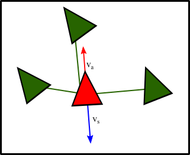
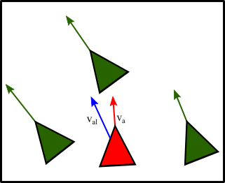
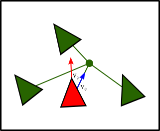
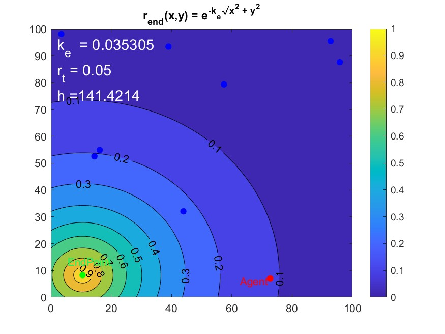
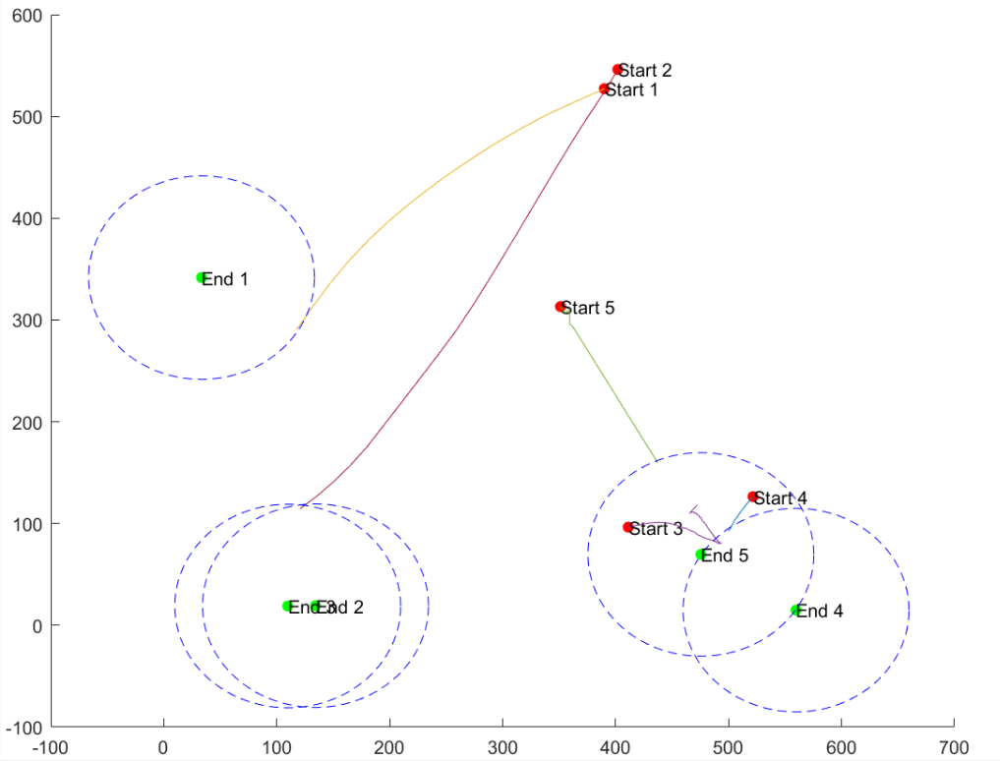

# Biologically Inspired UAV Guidance Using Reinforcement Learning

## Abstract

This project leverages reinforcement learning (RL) to cultivate flocking behaviour in drones, aiming to organize groups of UAVs through biologically inspired behavioural models. The primary focus is on simulating a multi-agent model and constructing a loss function to achieve emergent behaviour. The reward function's scalability with N agents is also explored. The actor-critic model is employed due to its capability to handle continuous action and observation states. The 2D environment is crafted by integrating potential field functions and boid flocking behavior. The agent steers drones using gains that enhance specific behaviours, training to maximize long-term cumulative rewards. The reward function is designed using variations of the exponential function to ensure flocking and arrival within a set number of steps. While flocking behaviour was successfully achieved and can be scaled, computational constraints posed limitations. Some drones occasionally prioritize flocking over reaching the destination, which is attributed to the reward function's design and certain simulation limitations. This research showcases the potential of reinforcement learning in multi-vehicle UAV applications. By transitioning the RL structure to a more fitting multi-agent particle environment, like those in the openAI database, the model can be applied at various scales with reduced computational demands.

<div align="center">

:book: For a comprehensive overview, refer to the [dissertation document](https://github.com/oscell/Biologically-inspired-UAV/blob/main/assets/Documents/Biologically_inspired_UAV.pdf). :book:

</div>

## Overview

This project delves into the intricacies of using reinforcement learning to guide UAVs, drawing inspiration from biological models. The environment is constructed using potential field functions and boid flocking behavior, and the agent learns to control drones by adjusting gains that amplify specific behaviors.

## Methods

### Boid flocking model 

With separation, alignment, and cohesion behaviours.


<div align="center">

| Separation | Alignment | Cohesion |
|:----------------:|:----------------:|:----------------:|
|  |  |  |

- Utilizing the actor-critic RL model to learn gains that control flocking behavior.
- Layering potential field and reward functions, shaping to foster flocking and ensure drones reach their destinations.

| Rewared Function | Potential Field  |
|:----------------:|:----------------:|
|  |  

</div>

### Trained Agent




## Repository Contents

[Matlab Simulation](https://github.com/oscell/Biologically-inspired-UAV/blob/main/MATLAB): The custom environment and the RL agent.

[Dissertation](https://github.com/oscell/Biologically-inspired-UAV/blob/main/assets/Documents/Biologically_inspired_UAV.pdf): The primary document detailing the research, methodology, and findings.
## Setup & Installation

```bash
git clone --recursive https://github.com/oscell/Biologically-inspired-UAV.git
```


## Results

The project's outcomes are:

- The RL agent successfully learns the emergent flocking behavior of drones.
- The significance of reward shaping in promoting desired behaviors is highlighted.
- Certain challenges, such as some drones not reaching their destinations, underscore the need for further refinement of the reward function.

## Future Work

Potential avenues for future exploration:

- Transition to a decentralized multi-agent approach to enhance the RL structure.
- Enrich the environment dynamics and introduce obstacles.
- Boost simulation speed using techniques like quad trees.
- Refine the reward function to rectify any undesirable behaviors.

## Reference

Meunier, Oscar. "Biologically inspired UAV guidance: Using reinforcement learning to optimize flocking behaviour." University of Glasgow, 2022.
